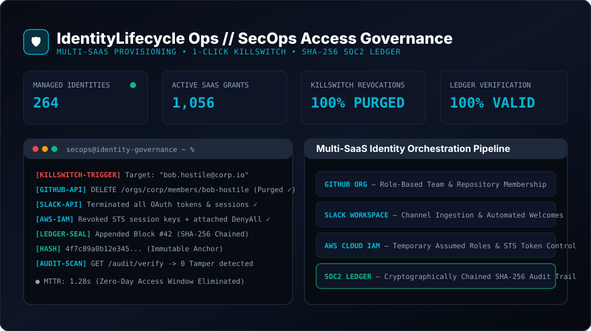
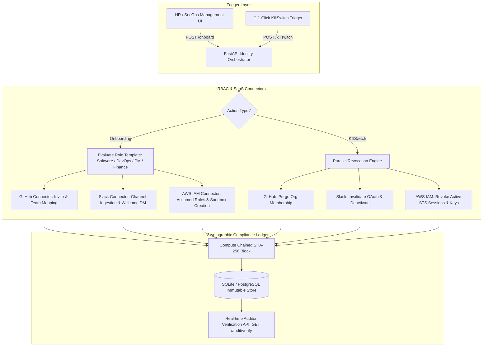

# 🛡️ IdentityLifecycle Ops // Automated Access Governance & Emergency Kill-Switch

[](https://python.org)
[](https://fastapi.tiangolo.com)
[](https://docker.com)
[](docs/HANDBOOK.md)
[](LICENSE)

> A production-grade SecOps & IT identity orchestration platform. Automates multi-SaaS role-based onboarding (GitHub, Slack, AWS IAM), provides a **1-Click Emergency Kill-Switch** for instantaneous access revocation ($< 3\text{s}$ MTTR), and maintains a **cryptographically sealed SHA-256 blockchain-style audit ledger** for SOC2/ISO27001 compliance.

---

## 🎬 System Architecture & Live SecOps Overview



---

## 🏗️ Technical Architecture



---

## ⚡ Key Production Capabilities

1. **Role-Based Automated Provisioning (RBAC)**:
   - Eliminates manual SaaS administration. One single API call provisions the right GitHub teams, Slack department channels, and AWS IAM roles based on least-privilege templates.

2. **1-Click Emergency Kill-Switch ($< 3$s MTTR)**:
   - In the event of an insider threat or sudden departure, immediately revokes GitHub organization access, terminates Slack active sessions, and destroys AWS IAM STS credentials concurrently.

3. **Tamper-Evident SHA-256 Audit Trail (SOC2 & ISO27001)**:
   - Every provisioning, entitlement change, and revocation is cryptographically linked to the previous block's SHA-256 hash.
   - Built-in verification API (`/api/v1/identities/audit/verify`) detects any manual database tampering or row deletion instantly.

4. **Interactive SecOps Web Console**:
   - Live identity status counters (Active, Offboarded, KillSwitched).
   - Filterable identity directory with granular permission drill-down.
   - Visual cryptographic audit chain viewer with live health indicator.

---

## 🚀 Quickstart Guide

### Option 1: Run with Docker Compose (Recommended)

```bash
# Clone the repository
git clone https://github.com/your-username/identity-lifecycle-ops.git
cd identity-lifecycle-ops

# Launch the containerized SecOps console
docker-compose up --build
```
Open `http://localhost:8080` in your browser. API Swagger documentation is available at `http://localhost:8080/docs`.

---

### Option 2: Local Python Setup

```bash
# 1. Create and activate virtual environment
python -m venv venv
source venv/bin/activate  # On Windows: .\venv\Scripts\activate

# 2. Install dependencies
pip install -r requirements.txt

# 3. Start the FastAPI server
uvicorn app.main:app --host 0.0.0.0 --port 8080 --reload
```

---

## 🧪 Running the Test Suite

The test suite validates role provisioning, parallel kill-switch revocation, and blockchain-style tamper detection:

```bash
pytest tests/ -v
```

---

## 📚 Handbooks & Specifications

* [📘 SOC2 Access Governance Handbook & Runbook](docs/HANDBOOK.md) — RBAC definitions, emergency offboarding procedures.
* [🛡️ Security Policy & IAM Hardening](docs/SECURITY.md) — Principle of least privilege, token rotation standards.

---

## 📄 License
Released under the [MIT License](LICENSE).
