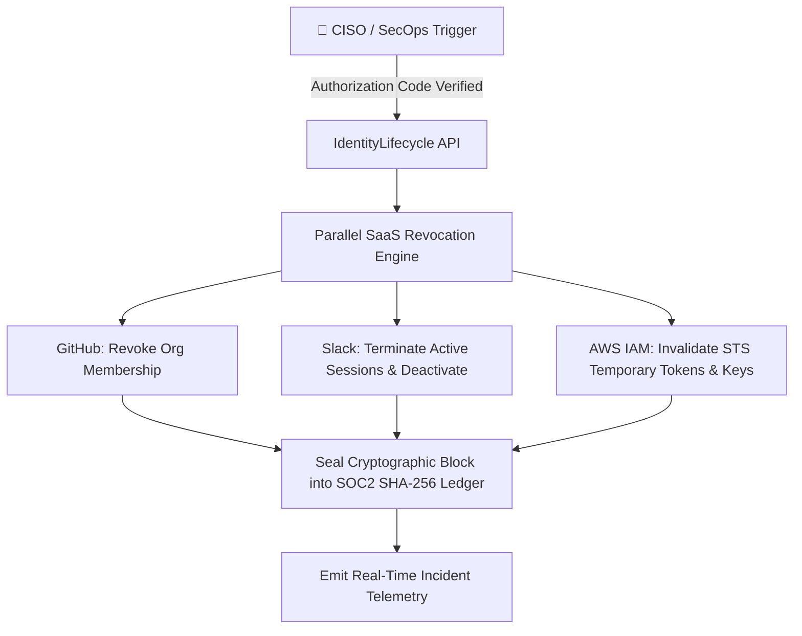

# 📘 SOC2 & ISO27001 Access Governance Handbook: IdentityLifecycle Ops

## 1. Governance Overview & Access Control Framework
**IdentityLifecycle Ops** enforces Zero-Trust least-privilege principles across enterprise SaaS environments (GitHub Organizations, Slack Workspaces, AWS IAM, Google Workspace).

---

## 2. Role-Based Access Control (RBAC) Matrix

| Role | GitHub Org Membership | Default Slack Channels | AWS IAM Role Assigned |
| :--- | :--- | :--- | :--- |
| **SOFTWARE_ENGINEER** | `push` (team: backend-devs, code-reviewers) | `#dev-announcements`, `#engineering`, `#frontend-backend` | `arn:aws:iam::*:role/DeveloperSandboxAccess` |
| **DEVOPS_ENGINEER** | `admin` (team: infra-core, sre-oncall) | `#infra-alerts`, `#engineering`, `#security-ops` | `arn:aws:iam::*:role/SREPlatformAdmin` |
| **PRODUCT_MANAGER** | `triage` (team: product-specs) | `#product-roadmap`, `#general`, `#customer-feedback` | `arn:aws:iam::*:role/DataAnalyticsReadOnly` |
| **FINANCE_ANALYST** | `none` | `#finance-ops`, `#general`, `#billing-alerts` | `arn:aws:iam::*:role/BillingAuditor` |

---

## 3. Emergency Offboarding / Kill-Switch Runbook



### SLA & Performance Standards
* **Mean Time to Revoke (MTTR)**: $< 3$ seconds across all downstream SaaS integrations.
* **Audit Seal Guarantee**: Every revocation event is committed to the blockchain-style SHA-256 ledger before the HTTP response is closed.

---

## 4. Cryptographic Ledger Verification

Auditors can verify ledger completeness and absence of tampering via:
```bash
curl -X GET http://localhost:8080/api/v1/identities/audit/verify
```

Expected Response:
```json
{
  "valid": true,
  "total_blocks": 48,
  "latest_block_hash": "e3b0c44298fc1c149afbf4c8996fb92427ae41e4649b934ca495991b7852b855",
  "message": "Cryptographic integrity verified across 48 audit blocks."
}
```
